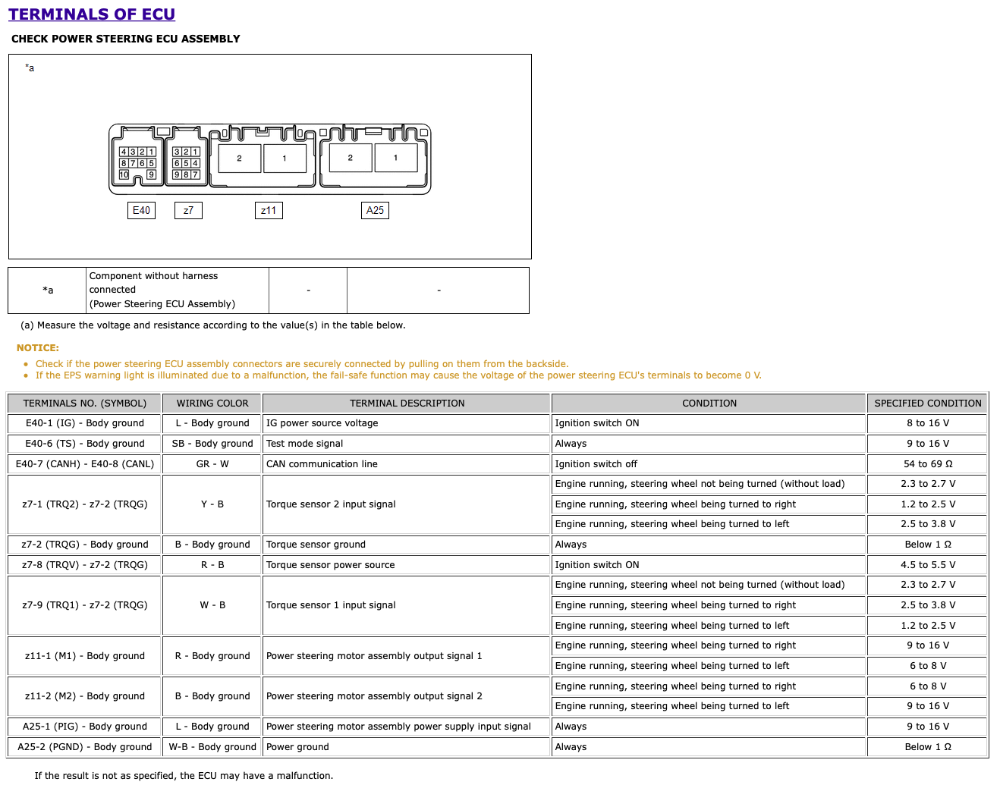

# Toyota 89650-02B50

### NOTES:
- This ECU is able to be controlled outside of the vehicle
- The EPS motor for this unit is installed in the steering column

## Terminals of ECU


## Part Numbers
#### Harness Connector E40
- Plug Body: 90980-12898
- Terminals: 82998-24290

#### Harness Connector A25
- Plug Body: 90980-12900
- Terminals: 82998-12400

#### OEM EPS motor
- Steering Column: 45250-02890

## Initialization and control

### Wiring
- Connect +VBATT to A25-1 and GND to A25-2
  - An 80A fuse is normally connected between A25-1 and +VBATT
- Connect E40-1 to IGN
- Connect E40-7 to CANH and E40-8 to CANL
- The unit should power on and go into limp-home mode (reduced assist) if CAN is not connected.

### Initialization
The following CAN messages are required to initialize the EPS so it can be controlled.
| ID (hex) | LENGTH (bytes) | Frequency (Hz) | NOTES |
|----------|----------------|----------------|-------|
| 0xaa | 8 | 40-84 | WHEEL_SPEEDS |
| 0x25 | 8 | 40-84 | STEER_ANGLE_SENSOR |
| 0xb4 | 8 | 40-84 | SPEED |
| 0x1c4 | 8 | 40-84 | [0x05, 0xea, 0x1b, 0x08, 0x00, 0x00, 0xc0, 0x9f] |
| 0x4xb | 8 | 40-84 | [0x66, 0x06, 0x08, 0x0a, 0x02, 0x00, 0x00, 0x00] |

*Note: If the above message specifies an array of bytes, it hasn't been identified. However, all you have to do is send those exact bytes at the provided frequency.*

DBC Samples:
```
BO_ 37 STEER_ANGLE_SENSOR: 8 XXX
 SG_ STEER_ANGLE : 3|12@0- (1.5,0) [-500|500] "deg" XXX
 SG_ STEER_FRACTION : 39|4@0- (0.1,0) [-0.7|0.7] "deg" XXX
 SG_ STEER_RATE : 35|12@0- (1,0) [-2000|2000] "deg/s" XXX

BO_ 170 WHEEL_SPEEDS: 8 XXX
 SG_ WHEEL_SPEED_FR : 7|16@0+ (0.01,-67.67) [0|250] "km/h" XXX
 SG_ WHEEL_SPEED_FL : 23|16@0+ (0.01,-67.67) [0|250] "km/h" XXX
 SG_ WHEEL_SPEED_RR : 39|16@0+ (0.01,-67.67) [0|250] "km/h" XXX
 SG_ WHEEL_SPEED_RL : 55|16@0+ (0.01,-67.67) [0|250] "km/h" XXX

BO_ 180 SPEED: 8 XXX
 SG_ ENCODER : 39|8@0+ (1,0) [0|255] "" XXX
 SG_ SPEED : 47|16@0+ (0.01,0) [0|250] "km/h" XXX
 SG_ CHECKSUM : 63|8@0+ (1,0) [0|255] "" XXX
```


### Control
CAN control message can be sent when the LKA_STATE signal is in the correct state. This can be found in CAN ID 0x262 (EPS_STATUS) and changes when CAN ID 0x2E4 (LKA_STEERING) is present on the bus.

DBC Sample:
```
BO_ 610 EPS_STATUS: 5 EPS
 SG_ IPAS_STATE : 3|4@0+ (1,0) [0|15] "" XXX
 SG_ LKA_STATE : 31|7@0+ (1,0) [0|127] "" XXX
 SG_ TYPE : 24|1@0+ (1,0) [0|1] "" XXX
 SG_ CHECKSUM : 39|8@0+ (1,0) [0|255] "" XXX

BO_ 740 STEERING_LKA: 5 XXX
 SG_ LKA_STATE : 31|8@0+ (1,0) [0|255] "" XXX
 SG_ STEER_REQUEST : 0|1@0+ (1,0) [0|1] "" XXX
 SG_ COUNTER : 6|6@0+ (1,0) [0|63] "" XXX
 SG_ SET_ME_1 : 7|1@0+ (1,0) [0|1] "" XXX
 SG_ STEER_TORQUE_CMD : 15|16@0- (1,0) [0|65535] "" XXX
 SG_ CHECKSUM : 39|8@0+ (1,0) [0|255] "" XXX
 ```

### Error States
In the EPS_STATUS message, the LKA_STATE is usefull for debugging. 
- State 1 - Good state, ready to listen for STEERING_LKA messages
- State 3 - Good (enough) state (it is missing the CAN messages that the camera sends, but they aren't required for controls to work), ready to listen for STEERING_LKA messages
- State 5 - LKA is active and in a good state
- State 9 - Temporary Fault (lasts 2 seconds)
- State 17 - Steering Rate is too high
- State 21 - Temporary fault triggered
- State 25 - Temporary fault triggered

If a fault is triggered, it will flip to that specific state for 1 frame, and then flip to state 9 for the duration of the lockout.

The ECU checks the parts of the STEER_ANGLE_SENSOR message to ensure that any STEERING_LKA messages are safe to apply. For example, if the STEER_RATE field is too high, the ECU will go into a fault state and not respond to STEERING_LKA messages for 2 seconds.

